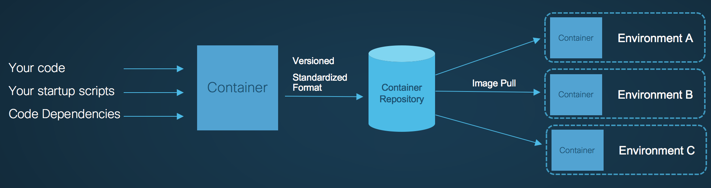
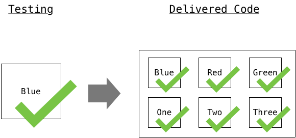
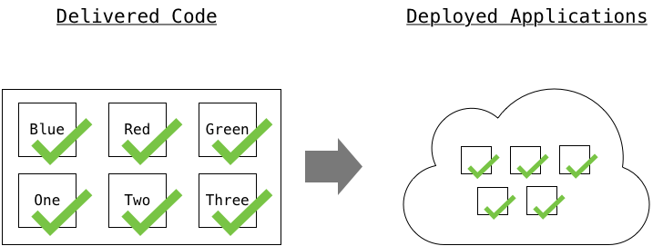

Introduction to CI/CD

# Objective

This learning lab will introduce you to Continuous Integration (CI) and Continuous Deployment (CD) techniques and principals designed to automate the workflow of a modern app developer.

Following on from the other 101 series Microservices track, we build on Docker-101, a basic understanding of using Docker to package your applications will be beneficial.

Completion time: 30 minutes

# Audience

* DevOps engineers
* Application developers
* IT teams addressing the developer need for Docker and Containers.

# Recap
As discussed in Docker-101; Containers are a wonderful packaging and portability solution for your application. By building your code, it's dependancies and simple startup scripts into a container, you can gaurantee it will execute consistently wherever someone runs it. Be that on the developer machine, in the QA test environment, or in production; 

This consistency cannot be said of many other packaging formats for applications (such as ZIP, JAR, RPM's, DEB's). While 'baked' VM images offer the same consistency benefits, containers have a much smaller footprint owing to them being just userspace (sharing the single OS kernel) and therefore also 'boot' near instantly.

# What is CI/CD?

## CI - Continuous Integration
Development projects often consists of many developers, all working on individual features and code. Eventually the individual work needs to be brought together and combined into a single code base. Individual developers should be testing their code as they work, but that code still needs re-verifying when it's part of the full codebase.

Even working solo on a project, there are advantages to knowing that each time you update your code "Something else" notices the change and re-run's all of your code tests against the changes, making your developer process look like this:

1. Edit Code
2. Code Repository - Commit Change
3. Repeat

Instead of this;

1. Edit Code
2. Code Repository - Commit Change
3. Manually run test suites against code using commandline or IDE
4. Wait for tests to complete
5. Repeat

This is CI, Automating the process of running your codebases' tests against any new changes in the codebase.

## CP - Continious Packaging

Technically, CI/CD Should be called CI/CP/CD, as once we have tested our code changes sucessfully, we need to package up the code in a way that is useful to deploy into our staging or production environments.

In mordern development automation, this is usually into Docker containers, which is why I mention it here.

All our code, plus any dependancies and startup scripts are packaged into a container so that we know our app will run consitently in whatever the destination environment is.

Because we have Automated CI, we can start to build a "pipeline", in which CI will automatically kick off the packaging of the software if the tests were passed.

Again, even in a solo developer scenario, not having to manually run `docker build .` followed by `docker tag` and `docker push` every time you change your code, is a considerable benefit.

## CD - Continious Deployment
Once new code has been packaged and placed somewhere accessible (such as a docker repository) it needs to be deployed so that users can take advantage of the new features or bug fixes.

If we choose to, the automation pipeline can do this automatically for each new code change, or potentially this goes through a manual "approval" step, it all depends on the developer or team configuring their CI/CD pipeline.

The deployment phase of CICD is the most affected by the rise of containers, deployment of software using automation used to involve spinning up new virtual machines, having the automation communicate with them using Puppet, ansible, or some other configuration management tool, then have that tool upgrade/install and setup the software and it's dependancies on the machines.

Nowadays, as the software and dependancies are already in our docker container, we simply tell our container orchestrator (such as Kubernetes, DC/OS, Docker Datacenter, etc) via it's API's to roll out the new version of our application containers.

Modern orchestrators can do this in a zero downtime way, through strategies such as only changing one (of many) instances at a time. These improvements make it much more likley to see teams enabling the full CI/CD pipeline through to production changes.

# Lets build it!

Ready to put your new CI/CD knowledge into practice? we'll build our own CI/CD pipeline and have it deploy some code updates for us! Click on the next page to begin!
