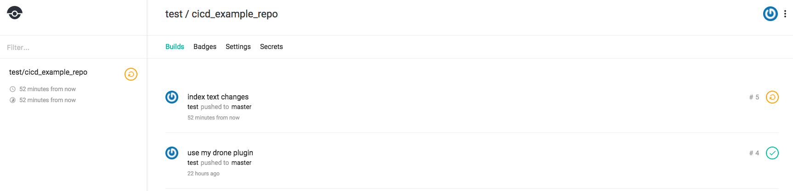
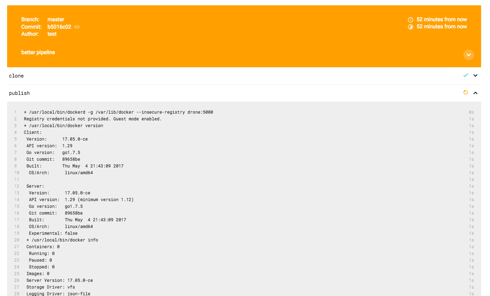
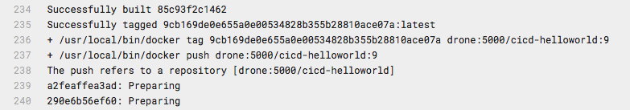
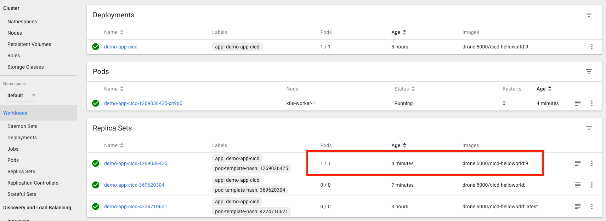

# CI/CD - Making Changes!

## 1. Change the APP

Making a change to our application is as simple as modifying our repository and commiting the changes, CI/CD will take care of the rest.

From our devbox edit index.html to say something else;

```
-Warm regards from the CICD Learning Lab demo app!
+The warmest regards from the CICD Learning Lab demo app!
```

Then commit those changes to our GOGS git repository;

```
git add index.html
git commit -m "index text changes"
git push cicd master
# gogs credentials are test/test
```
This will kick off a new build in drone, notice that drone includes the git commit message from the change, in my case: "index text changes"

 

(Reminder, Drone UI is at: [http://10.10.20.25/test/cicd_example_repo/]()).

Once the build has succeeded and turned green in drone, however, our simple pipeline configuration uses the tag `latest` for all our builds; kubernetes wont update our deployment from `latest` to `latest` as it looks the same.

... to make our changes reflect in production, most people use version tags instead of `latest`.

Since our pipeline configuration is just another file in our code repo, we can edit our CI configuration just as easily!

## 2. Change the CICD Pipeline

On our devbox, edit the `.drone.yml` file and replace the following lines:

```
tags: latest
tag: latest
```
with 

```
tags: ${DRONE_BUILD_NUMBER}
tag: ${DRONE_BUILD_NUMBER}
```

The full `.drone.yml` should now look as follows;

```
pipeline:
  publish:
    image: plugins/docker
    dockerfile: Dockerfile
    repo: drone:5000/cicd-helloworld
    registry: drone:5000
    insecure: true
    tags: ${DRONE_BUILD_NUMBER}
  deploy:
    image:  trxuk/kube
    kubernetes_server: http://master:8001
    namespace: default
    deployment: demo-app-cicd
    container: cicd-helloworld
    repo: drone:5000/cicd-helloworld
    registry: drone:5000
    insecure: true
    tag: ${DRONE_BUILD_NUMBER}
```

This will tell drone to use the drone current build number instead of the word `latest` for each of the docker images we produce.

git add and commit our drone changes, just like we did with `index.html`;

```
 git add .drone.yml
 git commit -m "better pipeline"
 git push cicd master
```

Going back to the drone UI, we can see the new build. By expanding the `publish` section in the UI, we can get a live feed of the commands being run; notice when we get to the point of uploading our new container image, it now has a version tag as a number, not just `latest`:
 

in my case, it's build `9`;
 

## SUCCESS!
Going back to our kubernetes UI, you will see from the "workloads" page that kubernetes has now noticed the change from deployment version `latest` to deployment version `9` (or another number in your case).



Checking our app again via curl from the kubernetes server, shows that with the new versioning, our new app content has finally been deployed!

```
[root@devbox cicd_learninglab_demo]# ssh root@10.10.20.1
root@10.10.20.1's password:
Last login: Tue Sep 19 10:14:18 2017 from devbox.abc.inc
[root@netmaster ~]# curl http://10.100.170.97
<html>
<header><title>CICD Learning Lab Demo App</title></header>
<body>
<h1> Hello world! </h1>
<p>
The warmest regards from the CICD Learning Lab demo app!
</body>
</html>
[root@netmaster ~]#
```

Future app changes will now take effect immediatley with the following process, as we have proper version numbering for our Docker images;

```
# edit index.html
git add index.html
git commit -m "new changes"
git push cicd master
```

Congratulations on building your first CI/CD pipeline with Docker, Drone and Git!

# More Information.
Drone has a wide number of existing plugins for testing, packaging and deployment targets, see the documentation pages here:

[http://readme.drone.io/0.4/usage/overview/](http://readme.drone.io/0.4/usage/overview/)


